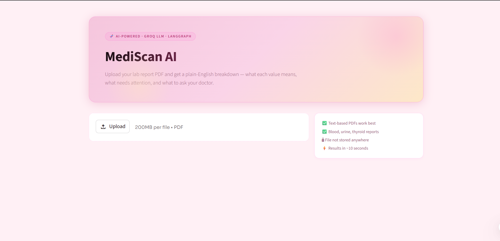

# 🩺 MediScan AI — Medical Report Simplifier

> Upload your lab report PDF and get a plain-English breakdown — what each value means, what needs attention, and what to ask your doctor.

---

## 📸 Demo



---

## ✨ Features

- 📄 **PDF Parsing** — Extracts lab values from any text-based medical report PDF
- 🧠 **Multi-Agent AI Pipeline** — 4 specialized agents powered by LangGraph
- 💬 **Plain English Explanations** — Every test value explained in simple language
- 🚦 **Severity Flagging** — Color-coded: Normal, Watch, High Priority, Critical
- ❓ **Doctor Questions** — Auto-generated questions to bring to your next appointment
- 🔒 **Privacy First** — Files are never stored; processed in-memory only
- ⚡ **Fast** — Groq LLM delivers results in ~10 seconds
- 📥 **Downloadable Report** — Export full analysis as JSON

---

## 🏗️ Architecture

```
PDF Upload
    │
    ▼
PDF Parser (PyMuPDF)
    │
    ▼
RAG Context Retrieval (ChromaDB + HuggingFace Embeddings)
    │
    ▼
┌─────────────────────────────────────┐
│         LangGraph Pipeline          │
│                                     │
│  ┌─────────────┐ ┌───────────────┐  │
│  │  Explainer  │ │   Flagging    │  │
│  │   Agent     │ │    Agent      │  │
│  └──────┬──────┘ └──────┬────────┘  │
│         └───────┬────────┘          │
│                 ▼                   │
│         ┌──────────────┐            │
│         │   Research   │            │
│         │    Agent     │            │
│         └──────┬───────┘            │
│                ▼                    │
│         ┌──────────────┐            │
│         │    Safety    │            │
│         │    Agent     │            │
│         └──────┬───────┘            │
└────────────────┼────────────────────┘
                 ▼
         Final Patient Report
```

---

## 🧰 Tech Stack

| Layer | Tool |
|---|---|
| LLM | Groq API (`llama-3.3-70b-versatile`) |
| Agent Framework | LangGraph |
| RAG / Vector DB | ChromaDB |
| Embeddings | HuggingFace `all-MiniLM-L6-v2` |
| PDF Extraction | PyMuPDF |
| Frontend | Streamlit |
| Language | Python 3.10+ |

---

## 🚀 Getting Started

### 1. Clone the repo

```bash
git clone https://github.com/YOUR_USERNAME/medical-report-agent.git
cd medical-report-agent
```

### 2. Create virtual environment

```bash
python -m venv venv
source venv/bin/activate        # Windows: venv\Scripts\activate
```

### 3. Install dependencies

```bash
pip install -r requirements.txt
```

### 4. Set up environment variables

```bash
cp .env.example .env
```

Edit `.env` and add your Groq API key:
```
GROQ_API_KEY=your_groq_key_here
```

Get a free key at [console.groq.com](https://console.groq.com) — no credit card needed.

### 5. Build the RAG knowledge base (run once)

```bash
python build_rag.py
```

### 6. Run the app

```bash
streamlit run app.py
```

Open [http://localhost:8501](http://localhost:8501) in your browser.

---

## 📁 Project Structure

```
medical-report-agent/
├── .streamlit/
│   └── config.toml         # Streamlit theme config
├── app.py                  # Streamlit frontend
├── agents.py               # LLM agent functions (Groq)
├── graph.py                # LangGraph multi-agent pipeline
├── pdf_parser.py           # PDF text + lab value extraction
├── rag_setup.py            # ChromaDB vector store setup
├── build_rag.py            # One-time RAG build script
├── schemas.py              # Pydantic output schemas
├── requirements.txt        # Python dependencies
├── .env.example            # Environment variable template
└── README.md
```

---

## 🤖 Agent Pipeline

| Agent | Role |
|---|---|
| **Explainer** | Translates each lab value into one plain-English sentence |
| **Flagging** | Assigns severity: Normal / Watch / High Priority / Critical |
| **Research** | Generates 3–5 smart questions to ask your doctor |
| **Safety** | Reviews output for diagnostic language; adds disclaimer |

---

## ⚙️ Requirements

Create a `requirements.txt`:

```
streamlit
langchain
langchain-groq
langchain-community
langgraph
chromadb
sentence-transformers
pymupdf
python-dotenv
pydantic
```

---

## 🔑 Environment Variables

| Variable | Description |
|---|---|
| `GROQ_API_KEY` | Your Groq API key from [console.groq.com](https://console.groq.com) |

---

## ⚠️ Disclaimer

This tool is for **educational purposes only** and does not constitute medical advice. Always consult a qualified healthcare provider for interpretation of lab results and medical decisions.

---

## 🙌 Acknowledgements

- [Groq](https://groq.com) — Ultra-fast LLM inference
- [LangGraph](https://github.com/langchain-ai/langgraph) — Multi-agent orchestration
- [ChromaDB](https://www.trychroma.com) — Local vector database
- [Streamlit](https://streamlit.io) — Rapid UI development

---

## 📄 License

MIT License — feel free to use, modify, and distribute.
